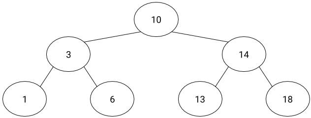

# Binary Search

## CodeDay Fall 2018 Advanced Computing Challenges

### ATLANTA, GA

## Introduction

Arrays are a very common data structure, mostly used for lists of things. As humans, if we’re given a sorted list of things, it’s pretty easy for us to find what we’re looking for: we just look where we are, estimate where it should be, and narrow our focus until we get to the entry we’re looking for. However, computers don’t have the luxury of a brain, so there are a variety of so-called “searching algorithms” to find the entry we’re looking for.

Most of these searching algorithms go through each entry in the array and see if it matches. If we have a very short array, this is no problem: it’s just a few operations before we find what we’re looking for. The issue comes from when we have *thousands* or *millions* of entries. Though computers are very fast, it would still take several seconds to find what we’re looking for.

## Solution

The solution to this issue is called *binary search*. The name comes from a binary (yes/no) comparison to see where in the array we need to go. The simplest way to represent binary search is with a *binary tree*.

Assume the following sorted array: `[1, 3, 6, 10, 13, 14, 18]`

This array can be represented by the following tree:

What we’ve constructed, now, is a tree where each *node* has a child to the left and right. You’ll notice that at every node, the child to the left is less than it, and the child to the right is greater. Look at 10, for example: 3 is to the left, and it is less, and 14 to the right is greater. The same is true of all child nodes, and of all binary search trees.

The reason we would use a binary search algorithm is because it gets us to our desired entry **significantly** faster than most other searching algorithms. At most, we have to check three different numbers to get to the number we’re looking for with this example; if we did a regular "guess-and-check", we’d have to do the number of entries – in this case, seven.

Try it yourself! Choose one of the numbers in the array. First, go through each number in the array, starting from the left, and see if that is the number you’re looking for. If not, move to the next until you find it. If you chose one of the larger numbers, it probably took a while.

Now, take that same number, and use the following algorithm to find it in the tree:

1. Assume you start at the top ("root") node.
2. Check if the number at the current node is your number.
3. If this is your number, stop. You’ve found your number!
4. If your number is less than the number at the current node, move to the left child.
5. If your number is greater than the number at the current node, move to the right child.
6. Return to step 2.

If you followed this algorithm correctly, it should have taken you at most three steps down the tree to determine where your number is, as opposed to seven with the guess-and-check method.

## Task

Your task is to implement the binary search algorithm in the language of your choice to find a variety of numbers found in `random-numbers.txt`. Driver files are available for Java, Node.JS, and Python. The method should return the index of the element; if it is not in the array, it should return -1.

If you need help, **don't google it!** Ask a CodeDay team member who will help you solve the problem.

Some hints:

1. To find the middle of the array (aka the root node), take the difference of the length minus the first index and divide by 2.
2. When finding the index of a child node, the first index may not be `0` (particularly if you move right in the tree).
3. If done properly, your method should have four parameters (it is possible with both).
4. You will need to use recursion or a while loop.

Good luck!
